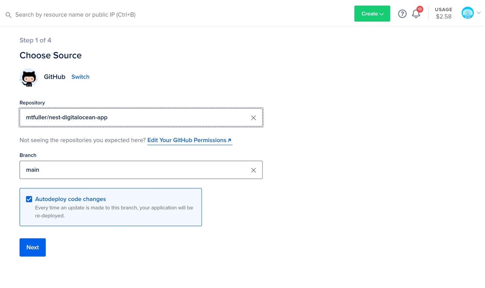

Nest.js is a Node.js API framework that includes a variety of built in tools for building robust services quickly.

In this tutorial, I'll show you how you can create your own simple Nest.js API service to add, update, and delete Restaurant information. Afterwards, we'll see how quickly we can host it using DigitalOcean's App Platform.

# **Setup**

First, let's install Nest globally.

```bash
npm install -g nest
```

Create a new Nest project using the global Nest CLI tool.

```bash
nest new nest-digitalocean-app
```

After running, you should now have a boilerplate Nest project.

# **Creating the "restaurants" endpoint**

Now, we are going to create the `/restaurants` endpoint with the following structure:

```
nest-digitalocean-app/
├─ src/
   ├─ restaurants/
      ├─ dto/
         ├─ create-restaurant.dto.ts
         ├─ update-restaurant.dto.ts
      ├─ restaurants.controller.ts
      ├─ restaurants.module.ts
      ├─ restaurants.service.ts
   ├─ ...

```

If you are new to Nest, this may look a bit daunting. Let's break it down.

### **DTO**

**`dto/`** - A folder to contain our [Data Transfer Objects](https://stackoverflow.com/a/1058186). These files define the data structure of a request body, when creating and updating a restaurant record.

```typescript
// src\restaurants\dto\create-restaurant.dto.ts
export class CreateRestaurantDto {
  name: string;
  description: string;
  rating: number;
}

```

### **Restaurants Controller**

**`restaurants.controller.ts`** - The entry point for the `/restaurnts`endpoint. Defines the different HTTP methods and route structure.

```typescript
// src\restaurants\restaurants.controller.ts
import {
  Controller,
  Get,
  Post,
  Body,
  Patch,
  Param,
  Delete,
} from '@nestjs/common';
import { RestaurantsService } from './restaurants.service';
import { CreateRestaurantDto } from './dto/create-restaurant.dto';
import { UpdateRestaurantDto } from './dto/update-restaurant.dto';

@Controller('restaurants')
export class RestaurantsController {
  constructor(private readonly restaurantsService: RestaurantsService) {}

  @Post()
  create(@Body() createRestaurantDto: CreateRestaurantDto) {
    return this.restaurantsService.create(createRestaurantDto);
  }

  @Get()
  findAll() {
    return this.restaurantsService.findAll();
  }

  @Get(':id')
  findOne(@Param('id') id: string) {
    return this.restaurantsService.findOne(+id);
  }

  @Patch(':id')
  update(
    @Param('id') id: string,
    @Body() updateRestaurantDto: UpdateRestaurantDto,
  ) {
    return this.restaurantsService.update(+id, updateRestaurantDto);
  }

  @Delete(':id')
  remove(@Param('id') id: string) {
    return this.restaurantsService.remove(+id);
  }
}

```

### **Restaurants Service**

**`restaurants.service.ts`** - Provides the business logic for the routes defined in `restaurants.controller.ts`.

```typescript
import { Injectable } from '@nestjs/common';
import { CreateRestaurantDto } from './dto/create-restaurant.dto';
import { UpdateRestaurantDto } from './dto/update-restaurant.dto';

@Injectable()
export class RestaurantsService {
  constructor() {}

  async create(createRestaurantDto: CreateRestaurantDto) {
// ...
  }

  async findAll() {
// ...
  }

  async findOne(id: number) {
// ...
  }

  async update(
    id: number,
    updateRestaurantDto: UpdateRestaurantDto,
  ) {
// ...
  }

  async remove(id: number) {
// ...
  }
}
```

### **Restaurants Module**

**`restaurants.module.ts`** - Defines RestaurantsModule, which will be imported into app.module.ts. This will allow the Nest service to serve the `/restaurants` endpoint.

```typescript
// src\restaurants\restaurants.module.ts
import { Module } from '@nestjs/common';
import { RestaurantsService } from './restaurants.service';
import { RestaurantsController } from './restaurants.controller';

@Module({
  controllers: [RestaurantsController],
  providers: [RestaurantsService],
})
export class RestaurantsModule {}

```

# **Connecting to a Postgres database**

Of course, we need a way to persist the Restaurant data to a database of some sort.

Luckily, DigitalOcean's App Platform offers the ability to create a "Dev Database". Simply put, it is a small Postgres database that can be connected to one or more sources.

To enable our app to connect to the Dev Database, let's first create a configuration file in our project to pull environment variables that will be loaded by the DO App Platform.

```typescript
// src/config/configuration.ts
export default () => ({
  port: parseInt(process.env.PORT, 10) || 3000,
  database: {
    host: process.env.DB_HOST,
    port: parseInt(process.env.DB_PORT, 10),
    user: process.env.DB_USER,
    password: process.env.DB_PASS,
    db: process.env.DB_DATABASE,

// In order to ensure we can connect to the DigitalOcean managed// database, we need to ensure that we include the generated Root// CA for the database.ca: process.env.DB_CA_CERT,
  },
});

```

This configuration file can be imported via the `ConfigModule.forRoot()` method. We can then use Nest's `TypeOrmModule` to load in the Postgres config info:

```typescript
// src/app.module.ts
import { Module } from '@nestjs/common';
import { AppController } from './app.controller';
import { AppService } from './app.service';

import { ConfigModule, ConfigService } from '@nestjs/config';
import { RestaurantsModule } from './restaurants/restaurants.module';
import configuration from './config/configuration';
import { TypeOrmModule } from '@nestjs/typeorm';

@Module({
  imports: [
// Load the configutation file we madeConfigModule.forRoot({
      load: [configuration],
    }),

// Configure TypeORM to connect to the Postgres databaseTypeOrmModule.forRootAsync({
      imports: [ConfigModule],
      useFactory: async (configService: ConfigService) => ({
        type: 'postgres',
        host: configService.get<string>('database.host'),
        port: configService.get<number>('database.port'),
        username: configService.get<string>('database.user'),
        password: configService.get<string>('database.password'),
        database: configService.get<string>('database.db'),
        ssl: {
          ca: configService.get<string>('database.ca'),
        },
        synchronize: true,
      }),
      inject: [ConfigService],
    }),

// Let's import RestaurantsModule so that we serve the /restaurants endpointRestaurantsModule,
  ],
  controllers: [AppController],
  providers: [AppService],
})
export class AppModule {}

```

We can even grab the port number defined in the config file from the `main.ts` file.

```typescript
// src\main.ts
import { ConfigService } from '@nestjs/config';
import { NestFactory } from '@nestjs/core';
import { AppModule } from './app.module';

async function bootstrap() {
  const app = await NestFactory.create(AppModule);

  const configService: ConfigService = app.get<ConfigService>('ConfigService');

  const port: number = configService.get<number>('port');
  await app.listen(port);
}
bootstrap();
```

# **Using TypeORM to persist data to Postgres**

Now let's create a TypeORM entity to define how the data needs to be saved to the Postgres database.

```typescript
// src\restaurants\restaurant.entity.ts
import { Entity, Column, PrimaryGeneratedColumn } from 'typeorm';

@Entity()
export class Restaurant {
  @PrimaryGeneratedColumn()
  id: number;

  @Column()
  name: string;

  @Column()
  description: string;

  @Column()
  rating: number;
}

```

Now, we can update `app.module.ts`to include the new Restaurant entity.

```typescript
// src\app.module.ts
import { Restaurant } from './restaurants/restaurant.entity';

...

TypeOrmModule.forRootAsync({
  imports: [ConfigModule],
  useFactory: async (configService: ConfigService) => ({
    type: 'postgres',
    host: configService.get<string>('database.host'),
    port: configService.get<number>('database.port'),
    username: configService.get<string>('database.user'),
    password: configService.get<string>('database.password'),
    database: configService.get<string>('database.db'),
    ssl: {
      ca: configService.get<string>('database.ca'),
    },

// Load the imported entity from aboveentities: [Restaurant],

    synchronize: true,
  }),
  inject: [ConfigService],
}),
```

Finally, let's update the `restaurants.service.ts` file to find, add, update, and delete Restaurant records in the Postgres database.

```typescript
import { Injectable } from '@nestjs/common';
import { CreateRestaurantDto } from './dto/create-restaurant.dto';
import { UpdateRestaurantDto } from './dto/update-restaurant.dto';
import { Restaurant } from './restaurant.entity';
import { InjectRepository } from '@nestjs/typeorm';
import { Repository } from 'typeorm';

@Injectable()
export class RestaurantsService {
  constructor(
    @InjectRepository(Restaurant)
    private restaurantRepository: Repository<Restaurant>,
  ) {}

  async create(createRestaurantDto: CreateRestaurantDto): Promise<Restaurant> {
    const restaurant = this.restaurantRepository.create(createRestaurantDto);

    return this.restaurantRepository.save(restaurant);
  }

  async findAll(): Promise<Restaurant[]> {
    return this.restaurantRepository.find();
  }

  async findOne(id: number): Promise<Restaurant> {
    return this.restaurantRepository.findOne(id);
  }

  async update(
    id: number,
    updateRestaurantDto: UpdateRestaurantDto,
  ): Promise<Restaurant> {
    const updateResult = await this.restaurantRepository.update(
      id,
      updateRestaurantDto,
    );

    if (updateResult.affected > 0) {
      return this.findOne(id);
    }
  }

  async remove(id: number) {
    const restaurant = await this.restaurantRepository.findOne(id);
    if (restaurant) {
      this.restaurantRepository.delete(id);
    }
  }
}

```

The full Nest API example GitHub repo can be found [here](https://github.com/mtfuller/nest-digitalocean-app).

# **Deploying the API**

Now we are ready to deploy our app!

If you have a GitHub account, you can easily connect it to the DigitalOcean App Platform. Then, simply select which repo you want to use to create and launch the app.

<p align="center">

</p>

From here, you can configure your app's HTTP routes, environment variables, run command, etc. following DigitalOcean's [App Platform How-To](https://docs.digitalocean.com/products/app-platform/how-to/create-apps/).

However, if you would like to quickly spin up this example to try it out, you can click the the "Deploy to DigitalOcean" button below.

[](https://cloud.digitalocean.com/apps/new?repo=https://github.com/mtfuller/nest-digitalocean-app/tree/main&refcode=012f39345103)

### Warning: Deploying the application may result in charges against your account.
