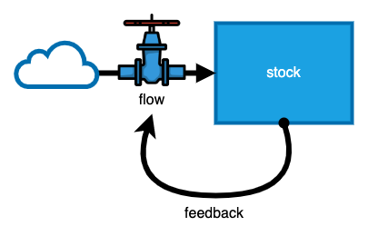
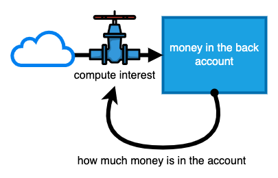
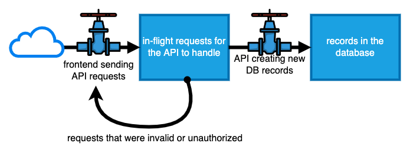
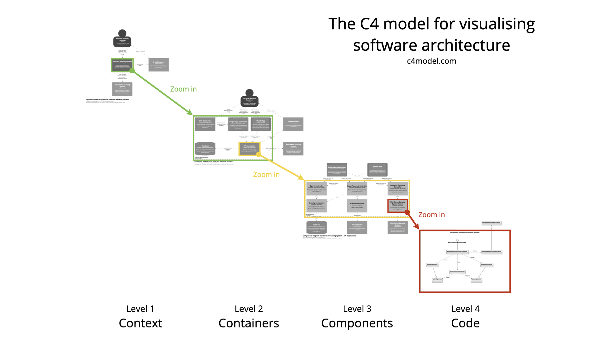

In the last post, we explored how "systems thinking" offers a framework for modeling the complexities of the world around us. It helps us to break apart something complicated into various parts or elements that interact with each other. Whether it be a beaver dam or a fighter jet, the systems thinking framework offers a way for us to understand and interact with the systems around us.

However, when systems are complicated they confuse and bewilder us. When we model a complex system, we tend to create simplified mental constructions of the system. Doing so allows us to keep our focus on the details that matter. While this sounds a bit abstract, it is a principle of life that we are all familiar with.

The human body is a perfect example of a familiar, yet complicated system. It is composed of tissue and organs working together to survive. Suppose a sick child is being examined by a pediatrician. As the doctor is evaluating the child's symptoms, he is most likely not considering the low-level, metabolic processes occurring in each individual cell. Rather, he is constructing a mental model to evaluate the high-level symptoms to propose an underlying cause. Suppose a neurologist is evaluating data to determine the effects of a new drug on brain activity. Would she be creating a mental model of the entire nervous system? Probably not. Instead, she would focus her scope to the problem being solved. When a system is complicated, we must create models that simplify the system to a point where we can understand and manipulate the system we are observing.

Similarly, software systems are complex. Software engineers cannot hope to ever understand every part of a codebase. So, how can we possibly understand enough to make changes or fix bugs? To understand and make strategic decisions with code, we must form mental models that we can utilize to create solutions. Systems thinking offers a refreshing approach to breaking down complex software into models that are understandable and practical.

## The Rise and Fall of UML

When thinking about modeling systems from a software perspective, one thing almost immediately comes to mind: UML. UML was a set of diagramming standards proposed in the 90's to attempt to make software models easily understood by the entire software industry.

However, UML largely failed to maintain relevancy in the industry. In 2017, the University of Trier, Germany conducted a survey of nearly 400 companies to determine how widely UML is being used in industry1. Their findings showed that most diagrams were informal and only used when designing, explaining, or understanding a system. Afterwards, they were archived.

Why is this? Why hasn't UML maintained its relevancy? I believe that this is due to UML being overly verbose and too time-consuming to maintain. Over time, class diagrams, state diagrams, etc. cease yielding value. Diagramming, while making it easier to model and visualize a codebase, brought almost no business value at the end of the day. As engineers are pushed to produce results, it became clear that creating and maintaining diagrams took precious time from engineers.

So, should our conclusion be that modeling yields no value? I don’t think so. The 2017 study shows that engineers still turn to informal diagrams. In my own career, I have seen this as the defacto standard. We need ways to communicate how software systems work. Architects need to communicate the service topology of a new solution. Tech leads need to discuss with product owners how their software will integrate with customers. To do business and solve problems effectively, we need to be able to quickly model the current state of the system.

## Modeling Systems

So, what then? If informal diagramming has replaced the verbose notation of UML, should we just abandon any careful thought and just start with boxes and lines? Should a box represent a service? A person? A process? Do we just start drawing and revising until we get something that feels right?

In Thinking in Systems, Meadows presents a general framework for modeling all kinds of systems that exist in our world.

### Stocks, Flows, and Feedback Loops

Meadows presents three primitive types of elements can can be used to model systems:

 - **Stock** - An element of the system that has a quantifiable state (i.e. water in a reservoir, bank account, number of rabbits in a national forest, etc.).
 - **Flow** - An element in the system that interacts between two stocks. A flow can increase or decrease a stock (i.e dam at the end of a reservoir, withdrawing money, hawks preying on rabbits, etc.).
 - **Feedback Loops** - An element in the system that signals a flow to change or adjust, depending on the state of a particular stock (e.g. the difference between the target temperature and room temperature signals the AC to turn on).

These three constructs can be used to model many types of systems. 

### Creating a Model

Suppose we wanted to model a bank account, in which interest is added based on the total amount of money in the account.

In this scenario, our stock would be the total money in the bank account. Our flow would be the bank calculating interest and transferring it to the account. The feedback loop would be the total amount in the account, which will affect the interest calculation. As time goes on, the interest added to the bank account exponentially increases the total amount.

Let's model another scenario. Suppose we want to model a simple todo list application that has a frontend UI and a backend API. 

In this application, a frontend UI will send HTTP requests to a backend API. As a user interacts with the UI to create new tasks, requests are sent to the backend API. As the API handles each request, new database records are created and persisted to the data layer.

How can we model this with stocks and flows? In this example, a user is interacting with the frontend UI, creating new in-flight HTTP requests to the backend. Since the total in-flight requests is a quantifiable state of the system, we can conclude that this is one of our stocks. In the same way, one of our flows is the frontend UI because it is causing our stock (in-flight requests) to increase. Similarly, the API (flow) is creating new records in the database (stock).

However, suppose the frontend sends a new HTTP request with invalid data. The backend API will (hopefully) send a response that indicates the request body is invalid. In a sense, we can say that there is a feedback loop in the system: the backend API sends an error response to the frontend UI.

## How Should We Model Software?

The 2017 study by the University of Trier showcases the importance of diagramming as a means of communication. I believe UML has lost relevance in areas of the software industry due to how verbose the notation is, and how costly it is to maintain. Instead of developing a large modeling notations, recent trends in software modeling have moved toward simpler modeling approaches. Simon Brown’s C4 architecture framework provides a simple notation and focuses on having different layers of granularity when visualizing a software system.

My argument is not that the software industry should now be using stock-and-flow diagrams. Rather, using stock-and-flow diagrams is an approach to breaking apart systems in the wild, without using a complicated notation. We can easily identify "stocks" in our software systems: records in a database, messages in a queue, requests being served by a microservice. These are quantifiable. If a "flow" is anything that can increase, decrease, or modify a "stock", then we could point to a few examples as well: an AWS lambda function handling a messages from a queue, a microservice adding a new entry to a Redis cache. Stock-and-flow diagrams offer a refreshing approach for modeling software.

## Final Words

Software systems are complex and to communicate effectively and move efficiently we need to model them. Modeling software didn't die with UML. It is alive and well. Newer approaches in software modeling rely on notations with a simple vocabulary, such as the C4 architecture framework. Meadows' systems thinking framework provides a way for us to define simple elements to model complex systems. As software applications grow increasingly complex, it's imperative that engineers and technologists adopt a systems thinking mindset in our work.

#### Footnotes

1. S. Baltes and S. Diehl. Sketches and Diagrams in Practice. https://arxiv.org/pdf/1706.09172.pdf